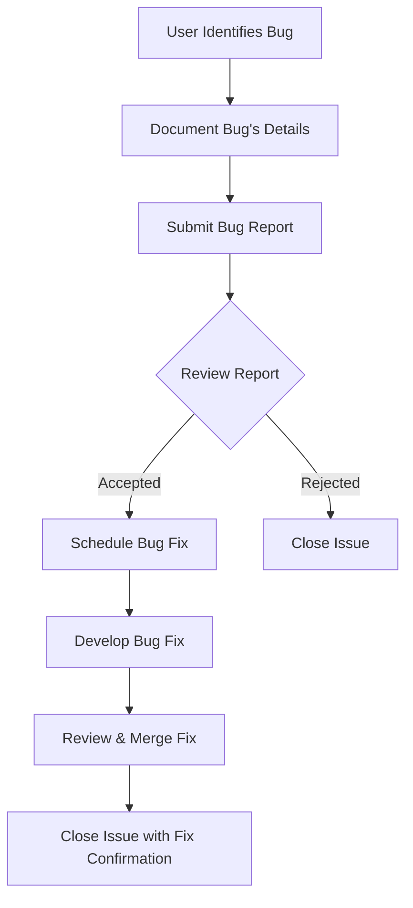

# Bug Report Workflow

This workflow outlines the process for submitting and handling a bug report in our project.

Steps:
1. The user identifies a bug.
2. The user documents the bug's details.
3. The user submits the bug report through the issue tracker.
4. The development team reviews the bug report.
5. If accepted, the bug is scheduled for a fix in the development pipeline.
6. The team works on the bug fix.
7. The fix is reviewed and then merged into the main branch.
8. The issue is closed after confirmation that the bug is fixed.



# User Management API Documentation

## Introduction

Welcome to the User Management API documentation. This API provides access to user profiles, allowing for operations such as creating, reading, updating, and deleting user information.

## Authentication

Requests to this API must be authenticated using API keys. Include your API key in the request headers like so:


## API Endpoints

### Retrieve User Information

Retrieves detailed information about a user by their unique ID.

- **URL:** `/api/users/:id`
- **Method:** `GET`
- **URL Parameters**

  | Parameter | Type   | Description       |
  |-----------|--------|-------------------|
  | id        | String | The user's unique ID. |

- **Headers**

  | Header        | Value            |
  |---------------|------------------|
  | Authorization | Bearer YOUR_API_KEY_HERE |

- **Success Response**

  - **Code:** `200 OK`
  - **Content:**

    | Field     | Type    | Description              |
    |-----------|---------|--------------------------|
    | id        | String  | The user's unique ID.    |
    | name      | String  | The user's name.         |
    | email     | String  | The user's email address.|
    | createdAt | String  | Account creation date.   |

    ```json
    {
      "id": "123",
      "name": "John Doe",
      "email": "johndoe@example.com",
      "createdAt": "2024-01-01T12:00:00Z"
    }
    ```

- **Error Response**

  - **Code:** `404 NOT FOUND`
  - **Content:**
  
    ```json
    {
      "error": "UserNotFound",
      "message": "The user with the given ID was not found."
    }
    ```

- **Sample Call**

  ```bash
  curl -X GET "https://api.example.com/api/users/123" -H "Authorization: Bearer YOUR_API_KEY_HERE"
