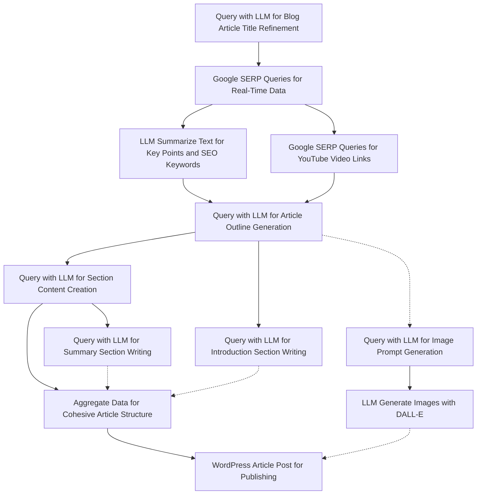

# Bug Report Workflow

This workflow outlines the process for submitting and handling a bug report in our project.

## Blog Article Writing Workflow
Steps:
1. Query with LLM for refining blog article titles based on initial keywords.
2. Google SERP Queries for gathering real-time data using keywords and locale settings.
3. LLM Summarize Text to process gathered data into a concise summary with key points and SEO-optimized keywords.
4. Query with LLM for generating an article outline, incorporating YouTube video links.
5. Query with LLM for content creation, writing detailed content for each article section.
6. Query with LLM for writing an engaging introduction section, including key takeaways.
7. Query with LLM for crafting a concise summary section, highlighting key points and including citations.
8. Google SERP Queries for YouTube links specifically, to include relevant video content.
9. Aggregate Data to combine content sections into a cohesive article structure.
10. WordPress Article Post to publish the complete article, including multimedia elements.
11. Query with LLM for generating image prompts for DALL-E.
12. LLM Generate Images with DALL-E based on prompts to create images for the blog post.



# User Management API Documentation

## Introduction

Welcome to the User Management API documentation. This API provides access to user profiles, allowing for operations such as creating, reading, updating, and deleting user information.

## Authentication

Requests to this API must be authenticated using API keys. Include your API key in the request headers like so:


## BurstyAI Workflow API Documentation

This documentation provides details on the BurstyAI Workflow API, designed for automating the generation and publication of SEO-optimized blog articles. It leverages the latest in Google search data, incorporates AI-generated images, YouTube links, and integrates specific company and product information, all while directly posting to WordPress.

### API Version

- **Version:** 1.0.0

### Base URL

- **URL:** `https://app.burstyai.com/burstyai/aiflows`
  - Description: BurstyAI workflow API server

### API Endpoints

#### Blog Article Writer

Generates and posts an SEO-optimized blog article to WordPress, utilizing Google search data, AI-generated images, YouTube links, and tailored company and product data.

- **Endpoint:** `/65e1aa9247065c0001e37a8b/execute`
- **Method:** `POST`
- **Description:** Automates the creation and posting of a blog article, ensuring SEO optimization, and inclusion of multimedia and tailored content.

##### Request Body

- **Content-Type:** `application/json`
- **Required:** Yes

###### Parameters

| Parameter                          | Type    | Description                                                                                      |
|------------------------------------|---------|--------------------------------------------------------------------------------------------------|
| `requiredParams.blog_title`        | string  | The title of the blog article.                                                                   |
| `requiredParams.blog_topic`        | string  | The main topic or subject of the blog article.                                                   |
| `optionalParams.section_amount`    | string  | Specifies the number of sections in the blog article.                                            |
| `optionalParams.tone_of_voice`     | string  | The tone of voice to be used in the article (e.g., informative, casual).                         |
| `optionalParams.BURSTYAI_SERP_COUNTRY` | string  | Country code for tailoring Google search results (e.g., "us", "uk").                             |
| `optionalParams.BURSTYAI_SERP_LANGUAGE` | string  | Language code for search results and article generation (e.g., "en", "es").                      |
| `optionalParams.BURSTYAI_LLM_CHAT_MODEL` | string  | Specifies the LLM model used for content generation.                                             |
| `optionalParams.BURSTYAI_WORDPRESS_POST_STATUS` | string  | Status of the WordPress post (e.g., "draft", "publish").                                         |
| `optionalParams.BURSTYAI_WORDPRESS_URL` | string  | The URL of the WordPress site where the article will be posted.                                  |
| `optionalParams.BURSTYAI_WORDPRESS_USER` | string  | Username for WordPress site access.                                                              |
| `optionalParams.BURSTYAI_WORDPRESS_PASSWORD` | string  | Password or application password for WordPress site access.                                      |
| `scheduler.cronExpression`         | string  | Cron expression for scheduling the workflow execution.                                           |
| `scheduler.timeZone`               | string  | User's browser timezone, must be a valid `java.util.TimeZone` ID.                                |

##### Responses

- **200 OK:** Workflow successfully initiated, returns a job execution ID.
  - `{"message": "Workflow job execution id indicating successful operation."}`
- **400 Bad Request:** Request failed due to missing or invalid parameters.
- **401 Unauthorized:** Incorrect API credentials provided.
- **500 Internal Server Error:** An error occurred in processing the request.

### Example Usage

To start the Blog Article Writer workflow, send a `POST` request to `/65e1aa9247065c0001e37a8b/execute` with the necessary JSON payload:

```json
{
  "requiredParams": {
    "blog_title": "The Future of AI in Healthcare",
    "blog_topic": "Healthcare"
  },
  "optionalParams": {
    "section_amount": "5",
    "tone_of_voice": "informative",
    "BURSTYAI_SERP_COUNTRY": "us",
    "BURSTYAI_SERP_LANGUAGE": "en",
    "BURSTYAI_LLM_CHAT_MODEL": "latest",
    "BURSTYAI_WORDPRESS_POST_STATUS": "draft",
    "BURSTYAI_WORDPRESS_URL": "https://yourwordpresssite.com",
    "BURSTYAI_WORDPRESS_USER": "admin",
    "BURSTYAI_WORDPRESS_PASSWORD": "yourpassword"
  }
}
