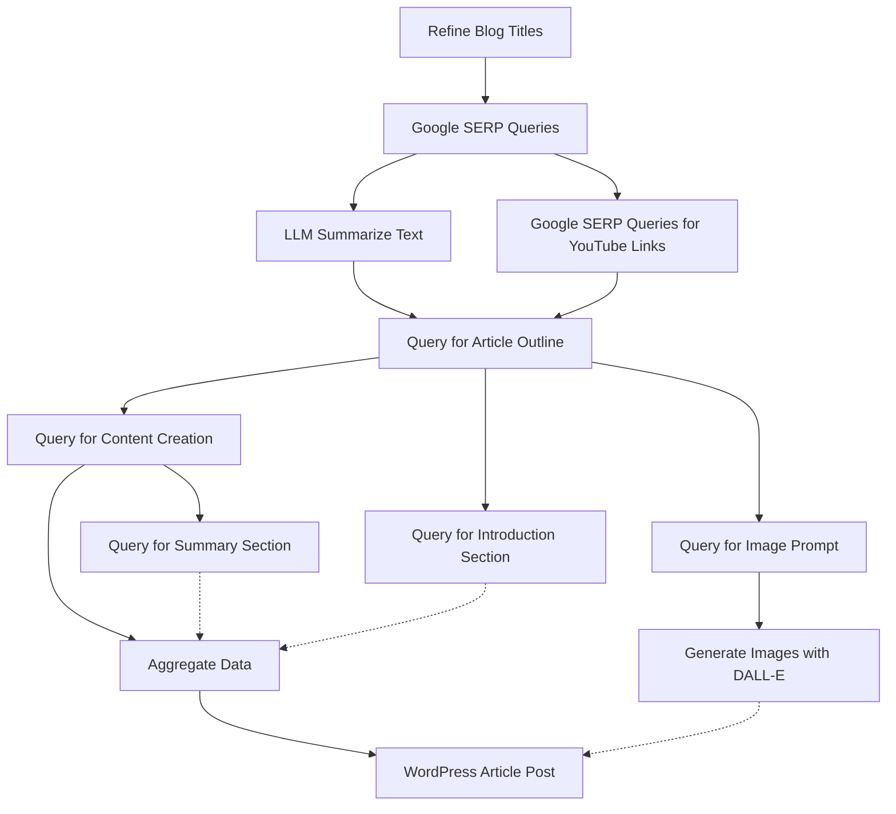

# Bug Report Workflow

This workflow outlines the process for submitting and handling a bug report in our project.

Steps:
1. Query with LLM for refining blog article titles based on initial keywords.
2. Google SERP Queries for gathering real-time data using keywords and locale settings.
3. LLM Summarize Text to process gathered data into a concise summary with key points and SEO-optimized keywords.
4. Query with LLM for generating an article outline, incorporating YouTube video links.
5. Query with LLM for content creation, writing detailed content for each article section.
6. Query with LLM for writing an engaging introduction section, including key takeaways.
7. Query with LLM for crafting a concise summary section, highlighting key points and including citations.
8. Google SERP Queries for YouTube links specifically, to include relevant video content.
9. Aggregate Data to combine content sections into a cohesive article structure.
10. WordPress Article Post to publish the complete article, including multimedia elements.
11. Query with LLM for generating image prompts for DALL-E.
12. LLM Generate Images with DALL-E based on prompts to create images for the blog post.



# User Management API Documentation

## Introduction

Welcome to the User Management API documentation. This API provides access to user profiles, allowing for operations such as creating, reading, updating, and deleting user information.

## Authentication

Requests to this API must be authenticated using API keys. Include your API key in the request headers like so:


## API Endpoints

### Retrieve User Information

Retrieves detailed information about a user by their unique ID.

- **URL:** `/api/users/:id`
- **Method:** `GET`
- **URL Parameters**

  | Parameter | Type   | Description       |
  |-----------|--------|-------------------|
  | id        | String | The user's unique ID. |

- **Headers**

  | Header        | Value            |
  |---------------|------------------|
  | Authorization | Bearer YOUR_API_KEY_HERE |

- **Success Response**

  - **Code:** `200 OK`
  - **Content:**

    | Field     | Type    | Description              |
    |-----------|---------|--------------------------|
    | id        | String  | The user's unique ID.    |
    | name      | String  | The user's name.         |
    | email     | String  | The user's email address.|
    | createdAt | String  | Account creation date.   |

    ```json
    {
      "id": "123",
      "name": "John Doe",
      "email": "johndoe@example.com",
      "createdAt": "2024-01-01T12:00:00Z"
    }
    ```

- **Error Response**

  - **Code:** `404 NOT FOUND`
  - **Content:**
  
    ```json
    {
      "error": "UserNotFound",
      "message": "The user with the given ID was not found."
    }
    ```

- **Sample Call**

  ```bash
  curl -X GET "https://api.example.com/api/users/123" -H "Authorization: Bearer YOUR_API_KEY_HERE"
