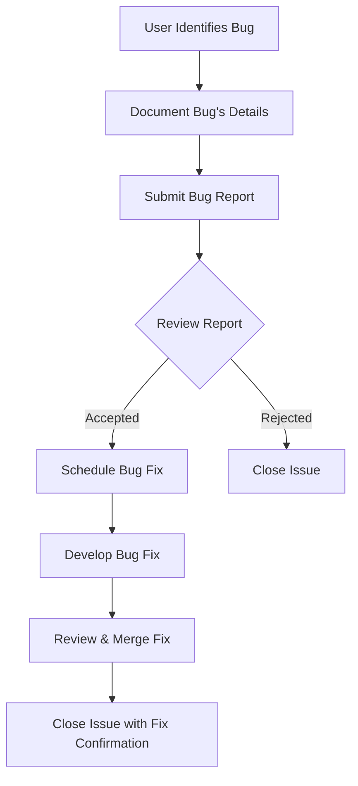

# Bug Report Workflow

This workflow outlines the process for submitting and handling a bug report in our project.

Steps:
1. The user identifies a bug.
2. The user documents the bug's details.
3. The user submits the bug report through the issue tracker.
4. The development team reviews the bug report.
5. If accepted, the bug is scheduled for a fix in the development pipeline.
6. The team works on the bug fix.
7. The fix is reviewed and then merged into the main branch.
8. The issue is closed after confirmation that the bug is fixed.



Hellow world1111

# To-Do List API Documentation

## Introduction

Welcome to the To-Do List API Documentation. This API allows users to manage their to-do list, with functionalities to add, retrieve, update, and delete to-do items.

## Authentication

This API requires authentication via API keys. Include your API key in the request header like so:


## API Endpoints

Below are the details of the API endpoints available.

### Retrieve a To-Do Item

Retrieves the details of a specific to-do item by its ID.

- **URL**

  `/todos/:id`

- **Method**

  `GET`

- **URL Params**

  **Required:**
  
  `id=[integer]` - The ID of the to-do item.

- **Data Params**

  None

- **Success Response:**

  - **Code:** 200 OK
  - **Content:**
  
    ```json
    {
      "id": 1,
      "task": "Buy milk",
      "completed": false
    }
    ```

- **Error Response:**

  - **Code:** 404 NOT FOUND
  - **Content:**
  
    ```json
    {
      "error": "ItemNotFound"
    }
    ```

- **Sample Call:**

  ```bash
  curl -i -H "Accept: application/json" -H "Authorization: ApiKey YOUR_API_KEY_HERE" "https://api.example.com/todos/1"
